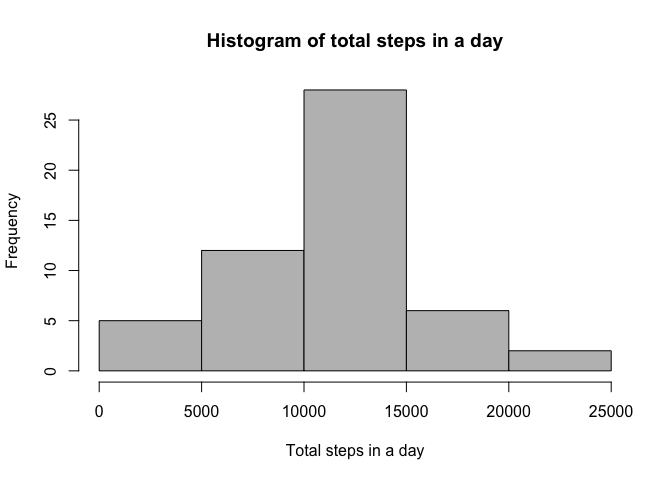

# Reproducible Research: Peer Assessment 1
## Introduction

This assignment makes use of data from a personal activity monitoring device. This device collects data at 5 minute intervals through out the day. The data consists of two months of data from an anonymous individual collected during the months of October and November, 2012 and include the number of steps taken in 5 minute intervals each day.

We follow [google's R Style Guide](https://google-styleguide.googlecode.com/svn/trunk/Rguide.xml) in this document.   

The code and the Rmd file have been edited and tested on a Mac laptop with the RStudio IDE.

## Data used in the project

The data for this assignment can be downloaded from the course web site:

* Dataset: [Activity monitoring data](https://d396qusza40orc.cloudfront.net/repdata%2Fdata%2Factivity.zip) [52K]

The variables included in this dataset are:

* **steps**: Number of steps taking in a 5-minute interval (missing values are coded as `NA`)

* **date**: The date on which the measurement was taken in YYYY-MM-DD format

* **interval**: Identifier for the 5-minute interval in which measurement was taken


The dataset is stored in a comma-separated-value (CSV) file and there are a total of 17,568 observations in this dataset.


## Loading and preprocessing the data
 
Show any code that is needed to

  1.Load the data (i.e. read.csv()).

  2.Process/transform the data (if necessary) into a format suitable for your analysis.


```r
# The remote file URL
file.url <- "https://d396qusza40orc.cloudfront.net/repdata%2Fdata%2Factivity.zip"

# Check the current directory to see if the data already exists, otherwise download&unzip it
if (!file.exists("activity.csv")) {
  download.file(file.url, destfile = "activity.zip",method = "curl")
  unzip("activity.zip")
}

# Load the data to a data frame
activity.df <-read.csv("activity.csv")

# Compactly display the structure of the data frame
str(activity.df)
```

```
## 'data.frame':	17568 obs. of  3 variables:
##  $ steps   : int  NA NA NA NA NA NA NA NA NA NA ...
##  $ date    : Factor w/ 61 levels "2012-10-01","2012-10-02",..: 1 1 1 1 1 1 1 1 1 1 ...
##  $ interval: int  0 5 10 15 20 25 30 35 40 45 ...
```

We noticed that there are 17568 observations of three variables: steps, date and interval.   
Certain values are unavailable in the original data set.   
Each day is divided into 288 five-minute intevals labeled 0 5 10 15 20 25 30 35 40 45 ... 

## What is mean total number of steps taken per day?
1. For this part of the assignment, you can ignore the missing values in the dataset.

2. Make a histogram of the total number of steps taken each day.

3. Calculate and report the mean and median total number of steps taken per day.


```r
# We aggregate steps as per date to get total steps in a day
# Now consider complete observations only. Ignore the rows with 'NA'
daily.sum <- aggregate(steps ~ date, data=activity.df, FUN = sum, na.rm=TRUE)
head(daily.sum)
```

```
##         date steps
## 1 2012-10-02   126
## 2 2012-10-03 11352
## 3 2012-10-04 12116
## 4 2012-10-05 13294
## 5 2012-10-06 15420
## 6 2012-10-07 11015
```
By checking the first several rows of the daily.sum data, we noticed that the data for date "2012-10-01" is missed.   
   
Use the data in daily.sum, we can plot the histogram of total steps in a day.

```r
# Create histogram of total steps in a day
hist(daily.sum$steps,
     main = "Histogram of total steps in a day",
     col="gray",
     xlab="Total steps in a day")
```

 

```r
# Find mean and median of daily steps
mean(daily.sum$steps)
```

```
## [1] 10766.19
```

```r
median(daily.sum$steps)
```

```
## [1] 10765
```
As shown above, the mean and median total number of steps taken per day are 10766.19 and 10765 steps respectively.

## What is the average daily activity pattern?

1. Make a time series plot (i.e. type = "l") of the 5-minute interval (x-axis) and the average number of steps taken, averaged across all days (y-axis).

2. Which 5-minute interval, on average across all the days in the dataset, contains the maximum number of steps?

We first use the `dplyr` package to generate a new data frame and the first several rows of the new data frame is shown. 
   

```r
# Alternatively, we use the dplyr to fulfill this task.
suppressMessages(library(dplyr))
interval.avg <- activity.df %>% 
                group_by(interval) %>% 
                summarize(avg.steps = mean(steps,na.rm=TRUE))
head(interval.avg)
```

```
## Source: local data frame [6 x 2]
## 
##   interval avg.steps
## 1        0 1.7169811
## 2        5 0.3396226
## 3       10 0.1320755
## 4       15 0.1509434
## 5       20 0.0754717
## 6       25 2.0943396
```

Then we plot the time series of average steps with respective to intervals of a day. Please notice that we transform the 'interval' to a time variable so that the time series is plotted correctly. The tick marks on the x-axis is also enhanced.
   

```r
# Plot the time series
plot(strptime(sprintf("%04d",interval.avg$interval),format="%H%M"), 
     interval.avg$avg.steps,
     type = "l",
     xlab = "Intervals in a day",ylab = "Average steps",col = "blue")
grid()
```

 

```r
maxint <- which.max(interval.avg$avg.steps)
interval.avg[maxint,]
```

```
## Source: local data frame [1 x 2]
## 
##   interval avg.steps
## 1      835  206.1698
```

From the time series plot, we notice that the peak value of steps appears in the morning. To be precise, we know that the interval 835 that corresponds to the interval from 8:35 AM to 8:40 AM, is of the maximum average number of steps 206.17 .

## Imputing missing values

Note that there are a number of days/intervals where there are missing values (coded as NA). The presence of missing days may introduce bias into some calculations or summaries of the data.  

1.Calculate and report the total number of missing values in the dataset (i.e. the total number of rows with NAs).

2.Devise a strategy for filling in all of the missing values in the dataset. The strategy does not need to be sophisticated. For example, you could use the mean/median for that day, or the mean for that 5-minute interval, etc.

3.Create a new dataset that is equal to the original dataset but with the missing data filled in.

4.Make a histogram of the total number of steps taken each day and Calculate and report the mean and median total number of steps taken per day. Do these values differ from the estimates from the first part of the assignment? What is the impact of imputing missing data on the estimates of the total daily number of steps?
    
By considering the incomplete rows in the original activity data frame,   

```r
nrow(activity.df[!complete.cases(activity.df),])
```

```
## [1] 2304
```
We can infer that the total number of rows with NA's in the original data set is 2304.    
    
To fulfill the imputation task, we choose to fill the NA's in the original dataset with the mean steps in that particular 5-minute interval, which we already computed and stored in the interval.avg data frame.

The implementation is quite simple. We just single out the rows with NA's and fill in them with the correspoinding average steps from data frame "interval.avg".


```r
# Single out the rows with NA
rowID <- which(is.na(activity.df$steps))
activity.df.imputed <-activity.df

#Fill the rows with the average steps in that interval
for (row in rowID){
  activity.df.imputed[row,c("steps")] <- 
    interval.avg[interval.avg$interval == activity.df.imputed[row,c("interval")],c("avg.steps")]
}

#Recaculate the daily activity statistics using the imputed data
daily.sum2 <- activity.df.imputed %>% 
              group_by(date) %>% 
              summarize(total.steps = sum(steps,na.rm=TRUE))
head(daily.sum2)
```

```
## Source: local data frame [6 x 2]
## 
##         date total.steps
## 1 2012-10-01    10766.19
## 2 2012-10-02      126.00
## 3 2012-10-03    11352.00
## 4 2012-10-04    12116.00
## 5 2012-10-05    13294.00
## 6 2012-10-06    15420.00
```
We recaculate the total steps in a day using the imputed data. By checking the first several rows, we find that the steps of date "2012-10-01" is imputed as anticipated.   

Now we can plot the histogram again.   


```r
hist(daily.sum2$total.steps,
     main = "Histogram of total steps in a day", 
     col="red",
     xlab="Total steps in a day")
```

 

```r
mean(daily.sum2$total.steps)
```

```
## [1] 10766.19
```

```r
median(daily.sum2$total.steps)
```

```
## [1] 10766.19
```
Due to the imputation, the mean value remains the same since the replacement of NA's by the mean values would not affect the mean at all.   

However, the histogram is altered due to the imputation. Now the frequency of the mean values is much larger than before. This induces the change of the median value as well, since the median is an order statistics. In our case, the mean value and the median value are the same for the imputed data set.


## Are there differences in activity patterns between weekdays and weekends?
For this part the weekdays() function may be of some help here. Use the dataset with the filled-in missing values for this part.

1. Create a new factor variable in the dataset with two levels - "weekday" and "weekend" indicating whether a given date is a weekday or weekend day.

2. Make a panel plot containing a time series plot (i.e. type = "l") of the 5-minute interval (x-axis) and the average number of steps taken, averaged across all weekday days or weekend days (y-axis).


```r
# Add a new variable which indicates if a given data is a weekday or weendend,
# And then trasform it to a factor
activity.df.imputed$day.type=ifelse( weekdays(as.Date(activity.df.imputed$date)) 
                                    %in% c("Saturday","Sunday"),
                                    "Weekend","Weekday")
activity.df.imputed = transform(activity.df.imputed,day.type = factor(day.type))

# To plot the time series correctly, we need to plot the x-axis variable
# as a time variable transformed from the original interval variable
dtPOSIXct <- strptime(sprintf("%04d",activity.df.imputed$interval),format="%H%M")
dtTime <- as.numeric(dtPOSIXct)
class(dtTime) <- "POSIXct"
activity.df.imputed$interval <- dtTime

# Aggregate steps with respective to interval and daytype
interval.avg2 <- aggregate(steps~interval+day.type,activity.df.imputed,mean)

library(ggplot2)
library(scales)

# Plot the time series for weekdays and weekends, respectively
qplot(interval,steps,data=interval.avg2,geom="line")+
      scale_x_datetime(labels = date_format("%H:00")) + 
      xlab("Intervals in a day") +
      ylab("Average steps in an interval") +
      facet_wrap(~ day.type, ncol=1)     
```

 

Obviously, there are certain differences between weekdays' and weekends' activity patterns.   
For instance, it is easy to notice that there are more activities in earlier morning for weekdays while more activities in the afternoon for weekends. 

Finally, we clear the workspace

```r
ls()
```

```
##  [1] "activity.df"         "activity.df.imputed" "daily.sum"          
##  [4] "daily.sum2"          "dtPOSIXct"           "dtTime"             
##  [7] "file.url"            "interval.avg"        "interval.avg2"      
## [10] "maxint"              "row"                 "rowID"
```

```r
rm(list = ls())
```
